# Kubeflow Pipelines and YOLOv3 Object detection
A detailed account of the work completed and steps to re-creation

## Table of Contents

### 0. [Setup and Installation](#setup-and-installation)

### 1. [Kubeflow Pipelines](#kubeflowpipelines)
-  **[Introduction to Kubeflow](#kubeintro)**
- **[What's a Kubeflow pipeline?](#what-is-a-kubeflow-pipeline)**
    - [Docker containers and images](#docker-containers-and-images)
    - [Image creation](#creating-a-docker-image)
- **[Building a custom pipeline and the kfp SDK](#building-a-custom-pipeline-and-the-kfp-sdk)**
    - [Building components](#1-building-components)
    - [Uploading components](#2-uploading-components)
    - [Organizing components and the pipeline compiler](#3-organizing-components-and-the-pipeline-compiler)
    - [Uploading pipeline configurations](#4-uploading-pipeline-configurations)
- **[Data passing in Kubeflow](#data-passing-in-kubeflow)**
- **[Running AFRL Fusion Kubeflow Pipeline](#running-afrl-fusion-kubeflow-pipeline)**
- **[Running Object Detection Kubeflow Pipeline](#running-object-detection-kubeflow-pipeline)**

### 2. [YOLOv3 Object Detection](#yolov3-object-detection)
   - **[Object Recognition](#object-recognition)**
   - **[R-CNN Family](#r-cnn-family)**
     - [R-CNN](#r-cnn)
     - [Fast R-CNN](#fast-r-cnn)
     - [Faster R-CNN](#faster-r-cnn)
   - **[YOLO Introduction](#yolo)**
   - **[YOLOv3 Usage](#yolov3-usage)**
     - [Creating a Dataset](#creating-a-dataset)
     - [Training YOLO on Custom Datasets](#training-yolo-on-custom-datasets)
     - [WandB](#wandb)
   - **[Importing from ONNX](#importing-from-onnx)**
     - [What is ONNX?](#what-is-onnx)
     - [ONNX Runtime](#onnx-runtime)
     - [Exporting PyTorch to ONNX](#exporting-pytorch-model-to-onnx)
     - [Running a YOLO ONNX Model](#running-a-yolo-onnx-model)
     - [Pre- and Post-processing](#pre--and-post-processing)

### 3. [Data Loader](#dataloader)
   - **[Overview](#overview)**
   - **[Usage](#usage)**
   - **[Documentation](#documentation)**
     - [save_from_hdf5](#save_from_hdf5)
     - [save_from_json](#save_from_json)
     - [save_from_labels](#save_from_labels)
     - [write_videos](#write_videos)
     - [shuffle(3)](#shuffle3)
     - [shuffle(4)](#shuffle4)
     - [clear_dir](#clear_dir)
    
### 4. [ONNX Model Inference](#onnxmodelinference)
   - **[Overview](#onnxoverview)**
   - **[Usage](#onnxusage)**
   - **[Documentation](#onnxdocumentation)**
     - [bb_intersection_over_union](#bb_intersection_over_union)
     - [load_bbox](#load_bbox)
     - [letterbox_image](#letterbox_image)
     - [preprocess](#preprocess)
     - [sigmoid](#sigmoid)
     - [softmax](#softmax)
     - [display_output](#display_output)
     - [run](#run)
    
### 5. [AFRL Fusion](#afrlfusion)
   - **[Quick Setup](#quick-setup)**
   - **[Detailed Setup](#detailed-setup)**
     - [Setup Virtualenvwrapper](#setup-virtualenvwrapper-optional)
     - [How to Use](#how-to-use)
     - [Regular Environment](#regular-environment)
     - [Train Environment](#train-environment)
     - [Downloading Weights](#download-pre-trained-weights)
   - **[Inference](#inference)**
     - [Run on a Video](#run-on-a-video)
   - **[Training](#training)**
     - [Setup Your Dataset](#setup-your-dataset)
     - [Running Training](#running-training)
     - [Hyperparameter Tuning](#hyperparameter-tuning)
   - **[Convert Between .pt and .weights Files](#convert-between-pt-and-weight)**
   - **[Results](#afrl-fusion)**
     - [Metrics](#fusionmetrics)
     - [F1 Score](#fusionf1)
     - [Prediction Collages](#fusionprediction)
     - [Inference Video](#fusioninference)

### 6. [Results](#results)
   - **[Color](#color)**
     - [Metrics](#vcimetrics)
     - [F1 Score](#vcif1)
     - [Prediction Collages](#vciprediction)
     - [Inference Video](#vciinference)
   - **[Thermal](#thermal)**
     - [Metrics](#thermalmetrics)
     - [F1 Score](#thermalf1)
     - [Prediction Collages](#thermalprediction)
     - [Inference Video](#thermalinference)
   - **[Multispectral](#multispectral)**
     - [Metrics](#multimetrics)
     - [F1 Score](#multif1)
     - [Prediction Collages](#multiprediction)
     - [Inference Video](#multiinference)
   - **[AFRL Fusion](#afrl-fusion)**
     - [Metrics](#fusionmetrics)
     - [F1 Score](#fusionf1)
     - [Prediction Collages](#fusionprediction)
     - [Inference Video](#fusioninference)


## Setup and Installation

The recommended way to set up this repository is by cloning it into a JupyterLab environment on the KRI server.
Here are the steps to installation:

1. Sign into the KRI server at 192.168.153.120 and start a new notebook server by going to 'Notebook Servers' in the sidebar.
2. Once the notebook has loaded, connect to it. It should show a launcher page that looks like this:
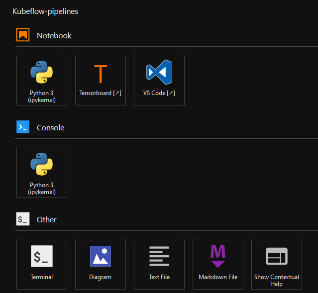
   
3. Open the Terminal under "Other". Run the commands:
``

`./setup.sh`

This will run the setup script, installing dependencies and cloning `yolov3` into the project. Alternatively, run the
commands:

`git clone https://github.com/SICA-Lab/Kubeflow-pipelines.git`

`sudo apt-get update && sudo apt-get install libsasl2-dev python-dev libldap2-dev libssl-dev`
   
and

`pip install -r requirements.txt`

To install the dependencies required for the project without cloning the `yolov3` repository.

4. The [tutorials](tutorials/) directory contains Jupyter notebooks with demonstrations on usage of this project.

## Kubeflow Pipelines <a name="kubeflowpipelines"></a>

This section will give an overview of Kubeflow, Kubernetes, and Docker. 
It contains simple tutorials and examples of Docker containers and Kubeflow pipelines.

---
### Introduction to Kubeflow <a name="kubeintro"></a>

From the [Kubeflow website](https://www.kubeflow.org/): 
> The Kubeflow project is dedicated to making deployments of machine learning (ML) workflows on Kubernetes simple, 
> portable and scalable. Our goal is not to recreate other services, but to provide a straightforward way to deploy best-of-breed open-source systems for ML to diverse infrastructures. Anywhere you are running Kubernetes, you should be able to run Kubeflow. 

Some definitions are required: 

**Containers** are portable software environments, in a sense mini computers. They contain everything needed to 
run an application; all the application code, application libraries, and any runtime required. For example, if I want to 
run a Python script in a container, the container will need to contain a Python interpreter and the script I want to run.
Containers are extremely useful for software that needs to scale, as the same app can be deployed and run simultaneously across
many containers.

**[Kubernetes](https://kubernetes.io/)** is a container orchestration software. It offers support
for deploying and managing containers, as well as allowing users to easily scale 
containerized apps. In essence, Kubernetes provides an API to control how and where containers will be run.

**[Kubeflow](https://www.kubeflow.org/)** is software overlaid on Kubernetes to allow for ease-of-use when building,
modifying, and deploying machine learning pipelines. It allows for machine learning pipelines
to be built using Kubernetes much more easily by coordinating much of the container setup and organization.

Kubeflow is an entire development environment, with the capability to host Jupyter notebook servers as well as
an interface for **Kubeflow Pipelines**

---
### What is a Kubeflow Pipeline?
> Kubeflow Pipelines is a platform for building and deploying portable, scalable machine learning (ML) workflows based on Docker containers.

Kubeflow has a user interface that allows for management of experiments and pipeline runs. It can automatically schedule 
multi-step workflows, which are extremely common in Machine Learning. Kubeflow Pipelines also provides an [SDK](#building-a-custom-pipeline-and-the-kfp-sdk) for defining
pipelines and pipeline components. 

Here is a screenshot from the Kubeflow Pipelines UI displaying an example pipeline:

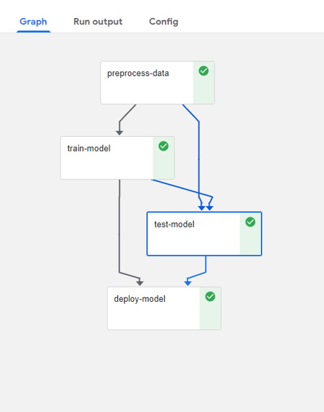

In this pipeline, there are four components, denoted by the four boxes. They are called `preprocess-data`, `train-model`,
`test-model`, and `deploy-model`. The arrows between the boxes are drawn by the Kubeflow Pipelines UI and indicate the flow 
of data between components. 

In essence, a Kubeflow Pipeline is a little assembly line, where each component completes a step of the process and passes 
its output on. In this example, the `preprocess-data` component will process the training, validation, and testing data that will be used with
the model. Once it has completed its task, Kubeflow will take the output from it and pass it to the `train-model` and `test-model` components.
`train-model` will use the training data from `preprocess-data` to train some machine learning model, and pass the trained
model into `test-model`. `test-model` will then use the trained model weights, together with the processed output from 
`preprocess-data`, to test the model's performance. Once `test-model` is complete, it will pass its scoring to `deploy-model`, which 
will run inference. The Kubeflow Pipelines platform will coordinate each component, ensuring that each one runs only after
all the required input data has been generated. In this example, `preprocess-data` must complete before Kubeflow will run
the `train-model` component, and so on.

Kubeflow Pipelines also allows for easy organization of modified pipelines, called 'experiments'. Each pipeline can be run many times, and
the Kubeflow Pipelines UI allows for organization of pipeline runs under experiments. For example, these are four different 
experiments used to run different versions of pipelines. The second through the fourth experiments are all run using different
versions of the same pipeline.

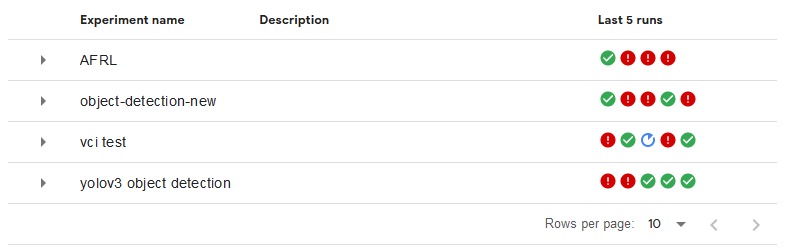

#### Docker Containers and Images
Docker is a container management platform. It allows for simple creation, modification, and sharing through a platform called
Docker Hub. Docker provides its own language, which is housed inside Dockerfiles. 
Docker provides a concept called **images**, which are frozen configurations that allow containers to be created. A **Dockerfile** is used to 
build an **image**, and then the **image** is run to create an isolated environment, a **container**.

#### Creating a Docker Image
To create a Docker image, we first need a Dockerfile, which defines what the new Docker image will contain, from
its runtime environment to any code that eventually be run on containers built from the image. Here is an example of 
a Dockerfile for an image that will access a file share for training data.
```Dockerfile
FROM python:3.7-slim

WORKDIR /app

COPY mount_smb.py ./mount_smb.py

RUN pip install -U smbprotocol

ENTRYPOINT ["python", "mount_smb.py"]
```

Only five lines! We'll go through it line by line. Each line starts with a keyword to tell Docker what to do. [Dockerfile keyword reference](https://docs.docker.com/engine/reference/builder/)

- The first line defines the parent image that we will build our custom image from. The `FROM`{:.Dockerfile} keyword
tells Docker to use `python:3.7-slim` as the parent image. This means that our new image will inherit all the 
contents of that image. This allows images to be configured very easily, as the `python:3.7-slim` image already
has a Debian Linux OS and the Python 3.7 interpreter. When we inherit from this image, we can immediately run Python 
scripts in containers created from our new image without any extra steps.

- The second line uses the `WORKDIR`{:.Dockerfile} keyword to tell Docker where to initialize the default working directory. 
This is like when you open a terminal and it starts at a certain path, i.e. `users/User/`. Now all of our commands will execute
from the `app/` directory. 

- The third line is where we pass in our code to our image that we want the container to run later. We use the `COPY`{:.Dockerfile} keyword 
to tell Docker to copy the `mount_smb.py` Python file into our `app/` directory in the new image. When we build and run the image,
we will have a directory with `app/mount_smb.py` in our new container. 

- The `RUN`{:.Dockerfile} tells Docker to run a given command as if it were executed in a terminal. In this case, we only need
one library that isn't already included in the `python:3.7-slim` parent image; the `smbprotocol` package. We can install
it on the image the same way we would install a library on our own computers. In this case I use `pip`.

- On the last line, we define an `ENTRYPOINT`{:.Dockerfile} that tells Docker what command to run when the container is constructed. 
In this case, when we build the image and run a container from it, Docker will automatically execute the `python mount_smb.py` command,
running the `mount_smb.py` Python script. 

---
### Building a custom pipeline and the kfp SDK

Now that we know what Kubeflow Pipelines does and how to construct Docker images and containers, we can look at how to 
build a Kubeflow pipeline for machine learning, from loading and preprocessing data to running training and inference.
<br><br>

#### 1. Building Components
Each component in a Kubeflow pipeline consists of a container. This container is configured to run some process and
(optionally) provide some output. Each container is organized into the pipeline by a pipeline compiler script. 

To build a component, we need a Dockerfile to define the container image and scripts that we will run in the container.

Here is an example of how a Kubeflow pipeline object could be organized. `image_passing_pipeline_remote_access` is the project root folder,
and holds all the pipeline components. In this example, there are four components: `mount_smb`, `preprocess`,
`test`, amd `train`. Each component has its own folder, with each folder containing a Dockerfile and a Python script.


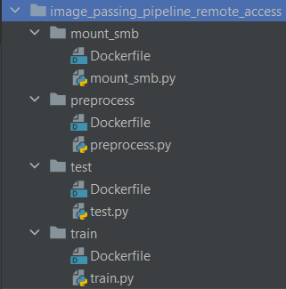


Let's say we want to build the `preprocess_data` component. The Dockerfile for this component is the same as the one 
covered in [Creating a Docker Image](#creating-a-docker-image):

```Dockerfile
FROM python:3.7-slim

WORKDIR /app

COPY mount_smb.py ./mount_smb.py

RUN pip install -U smbprotocol

ENTRYPOINT ["python", "mount_smb.py"]
```
 When run, this Dockerfile script will create a Docker container image that contains the `mount_smb.py` script and all of
the contents of the `python:3.7-slim` parent image. Ultimately, Kubeflow will create a container from the image.


When Kubeflow creates a container from the Docker image we defined, the `ENTRYPOINT` command will run 
the `mount_smb.py` script. This script is where the container will execute the behavior we want from our new component.

This is the contents of the `mount_smb.py` script:
```Python
def mount_smb(username, password):
    # Optional - specify the default credentials to use on the global config object
    smbclient.ClientConfig(username=username, password=password)

    # Optional - register the credentials with a server (overrides ClientConfig for that server)
    smbclient.register_session("192.168.152.34", username=username, password=password)

    with smbclient.open_file(r'\\192.168.152.34/DroneData/MatrixSpaceLabeled/05_08_20/DJI_Matice_100/2020-05-08-12-41-04-DM-Color_export.json', 'r') as f:
        json_file = json.load(f)

if __name__ == '__main__':
    print('mounting file share')
    parser = argparse.ArgumentParser()
    parser.add_argument('--username')
    parser.add_argument('--password')
    args = parser.parse_args()
    mount_smb(args.username, args.password)

```
This script loads a JSON file from a remote file share using the `smbclient` library.

The important thing to look at here is the `if __name__ == '__main__':` line. This is where the script is called
from by the Dockerfile. Notice we have two arguments, `username` and `password`. These will be passed in by our pipeline compiler.
<br><br>
#### 2. Uploading Components

Now that we've defined a Kubeflow component, we can look at how to create the Docker image and upload it for use.

We need to `cd` into the `mount_smb` folder, and then run the commands:
```commandline
docker build -t repository/container_name:tag .
```
This command tells Docker to build an image from the Dockerfile we've defined. The -t flag is to customize the
name of the built image. The format (`repository/container_name:tag`) will be used to make the image visible to a Kubeflow
instance.
- `repository` is the name of the repository where you want to add the image. 
The SICA Kubeflow instance has a repository at `192.168.152.34:5050`.
  
- `container_name` is the name of the image, which in this case will be `mount_smb` to match the name of the component
folder in the project.
  
- `tag` is for Docker's versioning system. The default is `latest`, but it can be specified to be anything.

To put this all together, our command in this example will be:
```commandline
docker build -t 192.168.152.34:5050/mount_smb:latest .
```

Now that our container image has been built, we need to upload it to the repository with the command:
```commandline
docker push {image id}
```
(note: the image id can be found by running `docker images` and finding the image that matches the one just built)

Now the pipeline component has been defined and uploaded to a repository to be accessed by Kubeflow.
<br><br>
#### 3. Organizing Components and the Pipeline Compiler

Now that we have a component, we can look at how to tell Kubeflow which components to run first. 
To do this, we will use the [`kfp` python library](https://kubeflow-pipelines.readthedocs.io/en/stable/). `kfp` is the SDK for creating Kubeflow Pipelines in Python.
To create a pipeline, we need to create component objects, kfp's `dsl.ContainerOp`. This creates an object that is
serializable by `kfp` into a component definition.


The code to define a Container object looks like this:
```Python
def mount_smb_op():
    return dsl.ContainerOp(
        name="Mount SMB Share",
        image="192.168.152.34:5050/mount_smb:latest",
        arguments=['--username', username,
                   '--password', password]
    )
```

To define our first component, we must pass `dsl.ContainerOp` some specifications. We need to give it the URL to the Docker
image we just created and pushed to a repository using the `image` parameter. The `arguments` are passed by `kfp` into the script given by `ENTRYPOINT`
in the Dockerfile, in this case `mount_smb.py`. Remember `__main__` took two arguments, `username` and `password`. These 
argument specifications should match between the container script and the pipeline configuration script.


Once we have created all our pipeline components, we can organize and compile our pipeline. We can use a function to define 
our pipeline organization by using the `@dsl.pipeline` decorator. This tells `kfp` to treat this function as a pipeline.
Inside our pipeline function, we want to call each of our component functions, such as the `mount_smb_op()` we defined above.
The arguments passed into some components will be discussed in the [data passing](#data-passing-in-kubeflow) section.

Once the pipeline function has been defined, we can use the [`kfp.compiler.Compiler()`](https://kubeflow-pipelines.readthedocs.io/en/stable/source/kfp.compiler.html) object to create a pipeline configuration
file. We just need to pass it the pipeline function and a filename.
```Python
@dsl.pipeline(
   name='data transfer pipeline',
   description='An example pipeline that loads an image from the SMB share and overlays a box'
)
def boston_pipeline():
    _mount_smb_op = mount_smb_op()
    _preprocess_op = preprocess_op()
    _train_op = train_op()

Compiler().compile(boston_pipeline, 'pipeline.zip')
```
Calling the `Compiler.compile()` function will give us a zip file that we can upload to Kubeflow.
<br><br>
#### 4. Uploading Pipeline Configurations
Once the pipeline has been compiled, we need to upload it to Kubeflow. Open the Kubeflow Dashboard and go to Pipelines -> Upload Pipeline:

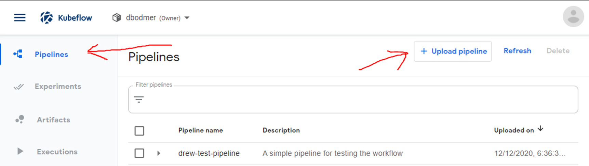

Once there, upload the zip file and it should appear in the Kubeflow Dashboard. 

---
### Data Passing in Kubeflow

Passing data between components in Kubeflow is essential to creating effective machine learning pipelines.
A basic tutorial will be provided here, but there is a [helpful Jupyter notebook](external_repos/Data%20passing%20in%20python%20components.ipynb)
that describes the process in more detail.


There are five modifications needed to pass data from one component to another: two changes to each component, and one
to the pipeline compilation script. 

First, we need to modify the container script itself to save the file we want to transfer. This is fairly straightforward,
as all we need to do is save the file to the container. We add: 
```Python
 with open('json_data.json', 'w+') as f:
     json.dump(json_file, f)
```
Notice that the file name is `json_data.json`. In the Dockerfile, the working directory is set to 
`/app/` so saving to `json_data.json` will save the file to `/app/json_data.json`.

```Python
def mount_smb(username, password):
    # Optional - specify the default credentials to use on the global config object
    smbclient.ClientConfig(username=username, password=password)

    # Optional - register the credentials with a server (overrides ClientConfig for that server)
    smbclient.register_session("192.168.152.34", username=username, password=password)

    with smbclient.open_file(r'\\192.168.152.34/DroneData/MatrixSpaceLabeled/05_08_20/DJI_Matice_100/2020-05-08-12-41-04-DM-Color_export.json', 'r') as f:
        json_file = json.load(f)

    with open('json_data.json', 'w+') as f:
        json.dump(json_file, f)

if __name__ == '__main__':
    print('mounting file share')
    parser = argparse.ArgumentParser()
    parser.add_argument('--username')
    parser.add_argument('--password')
    args = parser.parse_args()
    mount_smb(args.username, args.password)
```

Next, let's look at the container object we defined earlier. The `file_outputs` parameter is where we tell Kubeflow to 
look for the output file. In this case, the file path must be `/app/json_data.json` because we need to match the path to 
the file exactly. We will call the output `json_file`.
```Python
def mount_smb_op():
    return dsl.ContainerOp(
        name="Mount SMB Share",
        image="192.168.152.34:5050/mount_smb:latest",
        arguments=['--username', username,
                   '--password', password],
        file_outputs={
            'json_file': '/app/json_data.json',
        }
    )
```

Third, we need to modify the container object definition for the component that will **recieve** the file:
```Python
def preprocess_op(json_file):
    return dsl.ContainerOp(
        name='Preprocess Data',
        image='dbodmer0612/preprocess:latest',
        arguments=['--json_file', json_file],
    )
```
`preprocess_op` takes in an argument now, called `json_file`. It passes that argument via the `arguments` parameter
to the `preprocess` container.

Fourth, we need to modify the `__main__` function of the `preprocess.py` script to allow it to take in the argument:
```Python
if __name__ == '__main__':
    print('Preprocessing data...')
    parser = argparse.ArgumentParser()
    parser.add_argument('--json_file')
    args = parser.parse_args()
    _preprocess_data(args.json_file)
```
The `_preprocess_data` function takes in the argument passed by Kubeflow. Kubeflow passes the data via a filepath, so 
it can be loaded as follows:
```Python
def _preprocess_data(json_file):
    with open(json_file, 'r') as f:
        json_data = json.load(f)
```

The final adjustment that needs to be made is in the compilation script. We need to tell `kfp` to pass the output of `mount_smb`
into the `preprocess` component. To do this, we first get the output from `mount_smb` by using the `outputs` attribute of
the Cotainer object, which is a dictionary. We then find the name `json_file`, which matches the name specified. 
Once we have our output, we can pass it into the `preprocess` component via the `dsl.InputArgumentPath`.
We also must use the `.after()` method to ensure that the `preprocess` component only starts running once the `mount_smb` component
is finished.
```Python
@dsl.pipeline(
   name='data transfer pipeline',
   description='An example pipeline that loads an image from the SMB share and overlays a box'
)
def boston_pipeline():
    _mount_smb_op = mount_smb_op()
    
    mount_smb_output = _mount_smb_op.outputs['json_file']
    _preprocess_op = preprocess_op(
        dsl.InputArgumentPath(mount_smb_output)
    ).after(_mount_smb_op)
    
    _train_op = train_op()

Compiler().compile(boston_pipeline, 'pipeline.zip')
```
With this final change, the json file loaded by `mount_smb` can be successfully passed by Kubeflow into the
`preprocess` component.

---

### Running AFRL Fusion Kubeflow Pipeline

The AFRL Fusion pipeline can be deployed to Kubeflow and run as a pipeline. Inside the `AFRL_sensor_fusion_kubeflow` directory, there are three folders: `AFRL_sensor_fusion`, `rgb_data_loader`,
and `train_detector`. These three folders are each components of the AFRL pipeline. To build the components and compile 
the pipeline, follow the steps below.
1. Go into each folder and run the `build_and_push.sh` scripts. This will build a docker container from the Dockerfile 
and push it to a Docker repository.
   
2. Run the `pipeline.py` script. It will create a `pipeline.zip` file. 

3. Go to Kubeflow Dashboard, and under Pipelines, click on 'Upload Pipeline'. Upload the newly created `pipeline.zip` file.

4. Find the new pipeline in the Pipelines tab, and select it. Then click 'Create Run', and 'Start'. This will run the 
fusion pipeline.

---

### Running Object Detection Kubeflow Pipeline

The Object Detection pipeline can be deployed to Kubeflow and run as a pipeline. Inside the `yolov3_object_detection_kubeflow` directory,
there are several folders, each containing a component of the pipeline. To build the components and compile 
the pipeline, follow the steps below.
1. Go into each folder and run the `build_and_push.sh` scripts. This will build a docker container from the Dockerfile 
and push it to a Docker repository.
   
2. Run the `pipeline.py` script. It will create a `pipeline.zip` file. 

3. Go to Kubeflow Dashboard, and under Pipelines, click on 'Upload Pipeline'. Upload the newly created `pipeline.zip` file.

4. Find the new pipeline in the Pipelines tab, and select it. Then click 'Create Run', and 'Start'. This will run the 
fusion pipeline.

---

## YOLOv3 Object Detection
This section will give an overview of object detection methods, the structure and function of the YOLOv3 
object-detection model, and how to port model weights from ONNX.

---
### Object Recognition

**Object recognition** is an umbrella term encompassing several related
computer vision tasks that involve identifying objects in images. The two object recognition tasks that are relevant are
**Object classification** and **Object localization**. Classification is the process of determining the class of an object,
while localization is determining where the object is in the image. Together, these two tasks are called **object detection**.

- Image Classification: Predict the type of object in an image
   - Input: An image 
   - Output: A class label (one-hot vector where indices are mapped to class labels)
   

- Object Localization: Locate one or more objects in an image
   - Input: An image (with one or more objects)
   - Output: One or more bounding boxes (four values each) defining the predictions for the objects' locations
- Object Detection: Locate one or more objects in an image *and* assign a class label to each object
   - Input: An image
   - Output: One or more bounding boxes for each object location and a class label for each detected object. 

Here is an example of an image that could be used for input to an object detection model. In this image, there is one 
object of importance: the drone sitting on the ground.

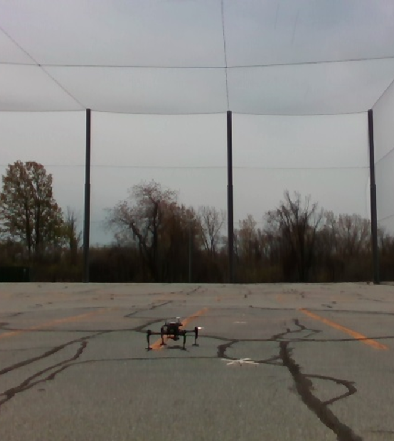

An object localization model will attempt to find the object in the image, in this case a drone. It will output four
values specifying a bounding box that the model thinks has the highest likelihood of containing the object. The output of
such a model would look something like this:

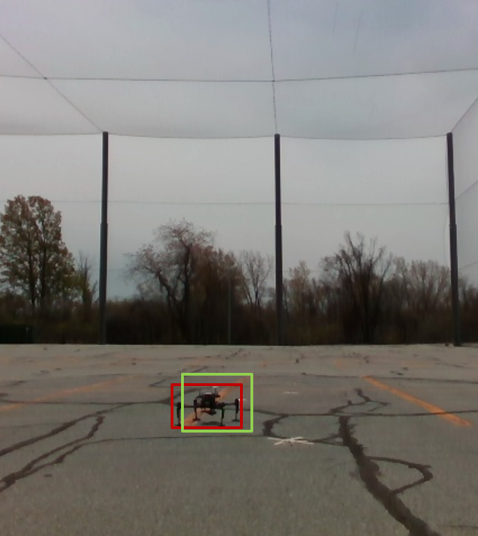

In this image, the ground truth label is colored red and the model prediction is colored in green. The model managed to 
find the object, but was slightly innacurate in its location. 

An object detection model will attempt to both find the object and classify it, and so it will output both a bounding box
and a class label. The output of an object detection model will look like the below image:

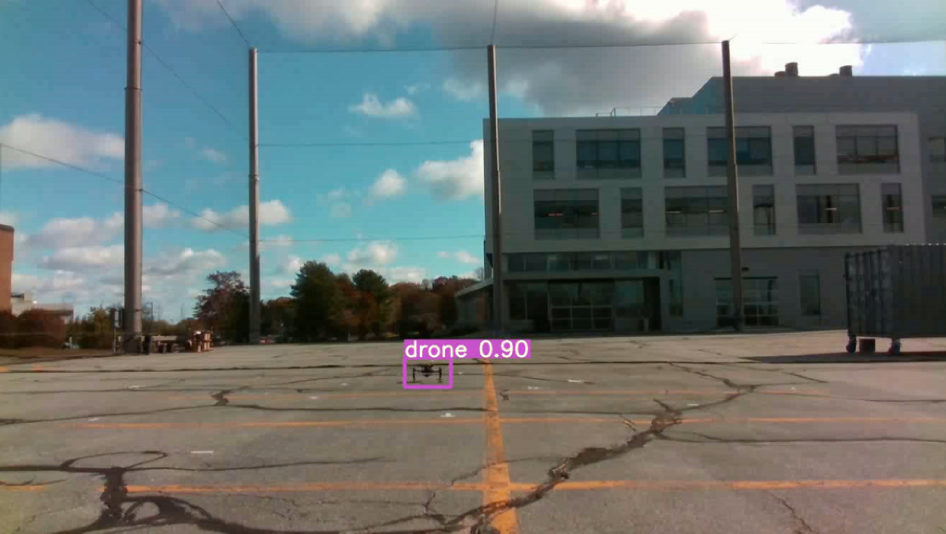

In this image, the model has located the object and classified it as a drone. The number next to the label corresponds to
the model's confidence in its prediction, i.e. how confident it is in both the localization and classification tasks.

---

### R-CNN Family

The R-CNN family is a group of methods that includes the R-CNN, Fast R-CNN, and Faster R-CNN which all are designed for
object detection tasks.

#### R-CNN

R-CNN stands for "Region-Based Convolutional Neural Network". It was first established in 2014 by Ross Girshick (UC Berkeley)
and was one of the first successful applications of convolutional neural networks to the problems of object classification and detection.
The original R-CNN consisted of three modules:
- Region Proposal: Generate candidate bounding boxes
- Feature Extractor: Extract features from each candidate region
- Classifier: Assign one of the known classes to each feature.

The problem with R-CNN is that it is very slow, requiring huge amounts of computation for the CNN feature extractor.


#### Fast R-CNN

Because R-CNN was very slow, a new model was proposed, called Fast R-CNN. It is a single model instead of a pipeline and uses a 
pre-trained CNN for feature extraction. The bounding box and class predictions are extracted from the output through fully connected layers.


#### Faster R-CNN

The R-CNN architecture was further improved by including a network propose and refine region proposals, which are then used 
with the Fast R-CNN model to make predictions. This reduces the number of region proposals, increasing the speed of the 
Fast R-CNN model. The region proposal network uses anchor boxes, which are pre-defined shapes designed to improve region
proposal.

---

### YOLO

The YOLO model family is named after a paper by Joseph Redmon titled "You Only Look Once: Unified Real-Time Object Detection".
It uses a single neural network that takes images as input and outputs bounding box and class predictions. It has lower
accuracy than the R-CNN family, but works much faster. In the original paper the model ran at 45 frames per second.
The model first splits the image into a grid of cells. Each cell produces a bounding box and a confidence, generating two
 outputs. These two outputs are the set of bounding boxes generated by the cells and a class probability map. They are 
eventually combined to generate the final predicitons This image from the YOLO paper summarizes the process:

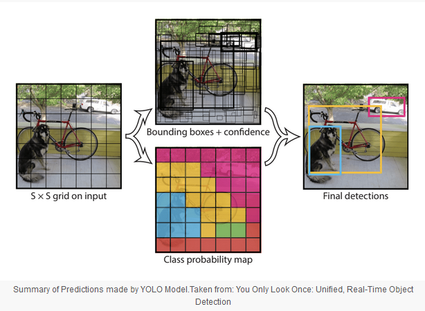

---

### YOLOv3 Usage
The [YOLOv3](yolov3) model was used to perform the object detection tasks for the lab, so
usage tutorials will be using this version.

#### Creating a Dataset
YOLOv3 requires datasets to be in a specific format in order for the training script to work correctly. 
The training, validation, and testing images, along with each set of labels, must be placed in a separate directory. The
file tree will look something like this:
```
+-- dataset_1
|  +--images
|  |  +--train
|  |  |  +--train_image1.jpg
|  |  |  +--train_image2.jpg
|  |  +--val
|  |  |  +--val_image1.jpg
|  |  |  +--val_image2.jpg
|  |  +--test
|  |  |  +--test_image1.jpg
|  |  |  +--test_image2.jpg
|  +--labels
|  |  +--train
|  |  |  +--train_image1.txt
|  |  |  +--train_image2.txt
|  |  +--val
|  |  |  +--val_image1.txt
|  |  |  +--val_image2.txt
|  |  +--test
|  |  |  +--test_image1.txt
|  |  |  +--test_image2.txt
```
Important notes:
- The label names must match the corresponding image names (except for the file extension); e.g. `train_image1.jpg` 
  corresponds to `train_image1.txt`. This is because YOLO uses the names to match the images with the labels.
  
- The folders `train`, `val`, and `test` should be named exactly that, as well as the `images` and `labels` folders. 
YOLO looks for these folder names when looking for the dataset.
  
- The labels should be in the format `class x y w h`, where the x and y values are to the center of the bounding box and
all values are normalized to be between zero and one. 
  

To tell YOLO where to find the dataset, a configuration file needs to be defined. It must have the paths to the training and 
validation directories specified, as well as the number of classes and the names of the classes. This config is defined
using a YAML file. Here is an example file, `data.yaml`, using the directory tree given above. 

```yaml
train: ./dataset_1/images/train/
val: ./dataset_1/images/val/

# number of classes
nc: 1

# class names
names: ['drone']
```

The configuration file does not need to specify the path to the test directory, as it is not used in training. The training
and validation directories are the paths to the **images** rather than the labels. YOLO uses the same path with 'images'
replaced with 'labels' to find the labels directory.
We also specify the number of classes and the names of the classes. In this case, there is only one class, `drone`, so 
the class definition is simple.

Image files are simply `png` images. Label files are `txt` files. An example label file could look like this:

`0 0.7899, 0.5683 0.0643 0.0912`

The zero is the index of the class label. Since we only have one label, this will be the same for all the label files.
The next two numbers are the x and y coordinates of the center of the bounding box, where (0,0) is top left and (1,1) is
bottom right. The last two numbers are the width and height of the bounding box, where (1,1) is the size of the image, 
and (0,0) means the box has no area.

**The yaml file should be placed under `yolov3/data`, as this is where yolo looks for it.**

<br></br>
#### Training YOLO on Custom Datasets

Once a dataset has been properly constructed (files in the correct directories, YAML configuration file created), the 
YOLO training script can be used on the dataset. The command must be run from the `yolov3` directory:

```commandline
python train.py --batch 32 --epochs 20 --weights yolov3.pt --data data.yaml --workers 2
```

- The `--batch` flag determines the batchsize used to train the model.
- The `--epochs` flag tells the training script how many epochs to train the model for.
- `--weights` takes a path argument that tells YOLO which weights file to start with for training. It will default to 
the `yolov3.pt`, the pretrained weights that come with the model.
- `--data` takes a path argument. This is the path to the yaml configuration file that we created.
- `--workers` tells YOLO how many data loader workers to use when running training. 
  
**On the KRI server, training runs can
occasionally crash if the GPU runs out of memory. To manage this, limit the batch size and the number of workers.**

Once the training is finished, the results will be saved in the `runs` folder inside the `yolov3` directory. In this 
folder, there will be metrics and example inference results, as well as the weights from the model.

#### Running Inference

To run inference with YOLOv3, we need some source images or video and some model weights.

To run inference, run this command from the `yolov3` directory:

```commandline
python detect.py --weights [path/to/weights/file.pt] --source [path/to/images/or/video.mp4]
```

#### WandB

Weights and Biases (WandB) is a metrics platform used by YOLO to display live training progress and metrics. 
To use WandB with YOLO, run `pip install wandb` on the command line, and create an account on the
[Weights and Biases](https://wandb.ai/) website. When training is run, it will provide an option to enter the API key 
for a WandB account. This can be found under 'User Settings' once logged in on the website.

---

### Importing from ONNX

YOLOv3 also has a MATLAB version, which functions the same way but uses the MATLAB computer vision toolkit. The Python
version of YOLO comes with export functionality, allowing users to export to both Tensorflow and ONNX formats. 
Unfortunately, there is import functionality for the Tensorflow format but not for ONNX.

#### What is ONNX?
ONNX stands for Open Neural Network Exchange, and is an ecosystem meant to allow for better transferability of neural 
networks. It establishes open standards for representing machine learning models to promote collaboration. 

#### ONNX Runtime

ONNX Runtime is a portable runtime environment for machine learning models that are in an ONNX format. It is compatible
with many classical machine learning libraries and a variety of hardware and operating systems. It also includes
performance optimizations for running inference on ONNX models. 

#### Exporting PyTorch model to ONNX
To export a trained PyTorch YOLO model to ONNX, follow [this tutorial.](https://github.com/ultralytics/yolov5/issues/251)

#### Running a YOLO ONNX Model
To run a YOLOv3 model using onnx runtime:
```python
import onnx
import onnxruntime as rt
import random
import glob
from PIL import Image

wtpath = '/home/jovyan/workspace/YoloThermal.onnx'
impath = random.choice(glob.glob('/home/jovyan/workspace/yolov3/labels_05_13_20_thermal/images/*/*.jpg'))
model = onnx.load('/home/jovyan/workspace/YoloThermal.onnx')
sess = rt.InferenceSession(wtpath)
image = Image.open(impath)
input_name = sess.get_inputs()[0].name
label_names = [o.name for o in sess.get_outputs()]
pred_onx = sess.run(label_names, {input_name: image})
```

onnxruntime will use the `YoloThermal.onnx` weights to run inference on an image.

#### Pre- and Post-Processing

Unfortunately, using onnxruntime without processing the inputs and the outputs will not be productive. The image first 
must be letterboxed, or converted to a shape that matches the input layer of YOLO. 


The output of onnxruntime on a MATLAB export is two tensors of shapes (18,14,14) and (18,28,28). This output is based on
the **anchors** that YOLO uses as part of its training and inference scheme. Instead of trying to predict the coordinates
of a box, it attempts to predict which anchor box contains an object and how much the shape of the box needs to be changed
to fit that object. In YOLOv3, there are two output layers, each with a number of anchors. The first output layer 
separates the image into a 14x14 grid (hence the 14x14 shape of the first tensor) and the second into a 28x28 grid.
At the center of each cell in the grid, three anchor boxes are placed. YOLO creates a prediction for each anchor. Since each
prediction has six values (x, y, width, height, objectness, and class confidence), that gives us the other dimension of 
the tensors; 3 * 6 = 18. To actually obtain the prediction, we need to find the anchor box that YOLO has given the highest
confidence of there being an object inside it, and get rid of all the other predictions.
This is called Non-Max Suppression. Once the anchor with the highest confidence is found, the output can be calculated.
The code that runs pre- and post-processing for MATLAB ONNX models is covered in [ONNX Model Inference](#onnxmodelinference)

---

## Data Loader <a name="dataloader"></a>

All of the available data can be loaded via three different methods: through HDF5 files, from zipped label files,
and directly from JSON files in the KRI server. The `dataloader.py` script provides functionality for easily loading
data from all three sources. HDF5 stands for Hierarchical Data Format 5, and is used to efficiently store large amounts
of data. The methods for attaining both types of data will be described in addition to how to use the data loader.

---

### Overview

The KRI training data is stored in two different formats; HDF5 and in jpeg image files. There are two different sources
of labels; one through separate labels files and the second through JSON files on the KRI server. The dataloader
provides methods for extracting data from each source. The HDF5 files are directly mounted to any KRI notebook server
root directly, but the image files are accessed using `smbprotocol`, and require a username and a password.
The data loader will also structure the data in the format required by YOLO.

**Important: The HDF5 files take a long time to download. The loader saves its progress for HDF5 downloads in 
`*_chkpt.txt` files. If an HDF5 download is paused, re-running the command will cause the loader to restart where it left
off as long as the checkpoint file is not moved or deleted.**

---

### Usage
There are two ways to use the data loader. It can be run from the commandline with the command:
```commandline
python dataloader.py [name of new dataset folder] --hdf5files [path to hdf5 files] --json [path to JSON file] 
--labels [path to labels folder] --username [username] --password [password] --type [type]
```

**Arguments:**
- `--dataset_path`: *Not optional*; the folder where the new dataset will be stored. If the folder does not exist the loader
  will create it. It is recommended to let the loader create the folder, as it will add the subdirectories required by YOLO.
- `--hdf5files`: The path to the directory containing the HDF5 files. This should be in
  [glob formatting](https://www.malikbrowne.com/blog/a-beginners-guide-glob-patterns), for example `'/path/to/files/*.jpg`
  represents all of the `.jpg` files in the `files` directory. If specifying one file, a fully-formed file path will work.
  
- `--json`: The path to the JSON file containing the labels and url to the images. The loader will attempt to find the file
both on the KRI server and locally.
  
- `--labels`: The path to the zip file or directory containing the labels. The loader expects the format to be a list of 
  text files with names matching the images they correspond to on the KRI server. The labels should be in the format 
  `x y w h` where the dimensions are in pixels and x and y are to the top left corner of the image.
- `--username`: A valid username to access the KRI file share at 192.168.152.34. HDF5 files do not require a username or
  password, as they are assumed to be local. 
- `--password`: A matching password to the given username.
- `--type`: The type of loader to run. The choices are `labels`, `json`, `hdf5`, and `all`. Defaults to `all`.
  - `labels` requires the `--labels` argument to be filled, as well as `--username` and `--password`.
  - `json` requires the `--json` argument as well as username and password.
  - `hdf5` requires the `--hdf5files` argument, but **does not** require the username and password **if the hdf5 files 
    are local.**
    
  - `all` requires all the arguments to be filled, as it will cause the loader to attempt to load data from every source.

The loader will download all the available data from the specified locations and shuffle it into training, validation, 
and test directories.

<br></br>
The second way to use the data loader is via a Python script or Jupyter notebook. This is a more easily repeatable and
flexible way to use the data loader. In the KRI server, the `DataLoader` object can be imported via 
```python
from dataloader import DataLoader
```
 Usage of the data loader is relatively similar to the command line case. Here is an example of creating an instance of
 the data loader object in Python:
```python
loader = DataLoader('yolov3/videocolor', hdf5files='./data_nas1/dronedb/data/*VideoColor*processed.hdf5', 
                    json_path=r'\\192.168.152.34/DroneData/MatrixSpaceLabeled/05_08_20/DJI_Matice_100/2020-05-08-12-41-04-DM-Color_export.json',
                    labels_path='./dataset_zip_files/labels.zip',
                    username='username', password='password')
```
The new `loader` will be a DataLoader object assigned to save data to the `videocolor` directory. It can access the HDF5
files in the `data_nas1/dronedb/data/` directory that have **both** 'VideoColor' and 'processed.hdf5' in their names. 
The 'r' before the string in the `json_path` argument means that the string is a _raw string_. Python will not recognize
any escape characters in this string. This is important, as the double backslash is required for `smbclient` to recognize
the path. The `labels_path` given is the path to a zip file in this repository of pre-downloaded labels.

---
### Documentation

Below is a description of all of the available methods in the Data Loader object.
<br></br>
#### save_from_hdf5:
`save_from_hdf5` loads all of the data in the provided path and saves it into the dataset directory. It saves progress
using a checkpoint text file, and so crashes can be restarted. It automatically 
normalizes labels to be between 0 and 1. To disable this, set `normalize` to false.

Parameters:
- `normalize`: whether to normalize labels to the [0,1] interval; default=True
  
Returns: `None`

Example:
```python
from python_scripts.dataloader import DataLoader
loader = DataLoader('yolov3/videocolor', hdf5files='./data_nas1/dronedb/data/*VideoColor*processed.hdf5')
loader.save_from_hdf5()
```
<br></br>
#### save_from_json:
`save_from_json` loads data from the provided JSON file into the dataset directory. It does not save progress, and will 
restart from the beginning of the given JSON file. It automatically normalizes labels, and this can be disabled by
setting `normalize` to false.

Parameters:
- `normalize`: whether to normalize labels to the [0,1] interval; default=True

Returns: `None`

Example:
```python
from python_scripts.dataloader import DataLoader
loader = DataLoader('yolov3/videocolor',
                    json_path=r'\\192.168.152.34/DroneData/MatrixSpaceLabeled/05_08_20/DJI_Matice_100/2020-05-08-12-41-04-DM-Color_export.json',
                    username='username', password='password')
loader.save_from_json(normalize=False)
```
<br></br>
#### save_from_labels:
`save_from_labels` downloads the images corresponding to the labels in the given labels file. It does not save progress,
and has the same behavior as `save_from_json`; restarting from the beginning if interrupted. It normalizes labels as 
well. 

Parameters:
- `normalize`: whether to normalize labels to the [0,1] interval; default=True

Returns: `None`

Example:
```python
from python_scripts.dataloader import DataLoader
loader = DataLoader('yolov3/videocolor', labels_path='./dataset_zip_files/labels.zip', username='username', password='password')
loader.save_from_labels()
```
<br></br>
#### write_videos:
`write_videos` uses the data it has downloaded to create videos for demonstration purposes or to run inference. It will
create a video of specified length for each source of images stored in the dataset. The video will be a random selection
from each set of images, so re-running it will produce different videos (provided the specified length is significantly
shorter than the number of source images).

Parameters:
- `length`: The length of the desired video, in number of frames.
- `video_name`: The name of the produced video.

Returns: `None`

Example:
```python
from python_scripts.dataloader import DataLoader
loader = DataLoader('yolov3/videocolor', hdf5files='./data_nas1/dronedb/data/*VideoColor*processed.hdf5', 
                    json_path=r'\\192.168.152.34/DroneData/MatrixSpaceLabeled/05_08_20/DJI_Matice_100/2020-05-08-12-41-04-DM-Color_export.json',
                    labels_path='./dataset_zip_files/labels.zip',
                    username='username', password='password')

loader.save_from_labels()
loader.save_from_json()
loader.save_from_hdf5()

loader.write_videos(100, 'video.mp4')
```
<br></br>
**There are two versions of `shuffle` provided by the data loader.**
#### shuffle(3):
`shuffle(3)` randomly shuffles all the images and their corresponding labels based on the provided split ratio. Each
of the three loading methods call shuffle after completion of download, but shuffle can also be called manually to
re-shuffle the data and/or change the split ratio.

Parameters: 
- `train_dir`: The path to the directory containing the images used for training, in glob format.
- `val_dir`: The path to the directory containing the images used for validation, in glob format.
- `split`: The proportion of images to put in the training directory. For example, `0.8` will cause shuffle to put 80% 
of all the images into the training folder.
  
Returns: `None`

Example:
```python
from python_scripts.dataloader import DataLoader
loader = DataLoader('yolov3/videocolor', labels_path='./dataset_zip_files/labels.zip', username='username', password='password')
loader.save_from_labels()
loader.shuffle('yolov3/videocolor/images/train/*.jpg', 'yolov3/videocolor/images/val/*.jpg', split=0.8)
```
<br></br>
#### shuffle(4):
`shuffle(4)` performs the exact same behavior as `shuffle(3)`, except splits a proportion of the data into the test 
directory as well.

Parameters: 
- `train_dir`: The path to the directory containing the images used for training, in glob format.
- `val_dir`: The path to the directory containing the images used for validation, in glob format.
- `test_dir`: The path to the directory containing the images used for testing, in glob format.
- `split`: A tuple representing the proportion of images to put in the training and validation directories. For example,
  `(0.6, 0.8)` will put 60% of the images into training, 20% into validation, and 20% into testing.
  
Returns: `None`

Example:
```python
from python_scripts.dataloader import DataLoader
loader = DataLoader('yolov3/videocolor', hdf5files='./data_nas1/dronedb/data/*VideoColor*processed.hdf5')

loader.save_from_hdf5()
loader.shuffle('yolov3/videocolor/images/train/*.jpg', 'yolov3/videocolor/images/val/*.jpg', 
               'yolov3/videocolor/images/test/*.jpg', split=(0.6, 0.8))
```
<br></br>
#### clear_dir:
Parameters: `None`

`clear_dir` clears the dataset directory completely. **This cannot be undone**.

Returns: `None`

Example:
```python
from python_scripts.dataloader import DataLoader
loader = DataLoader('yolov3/videocolor', hdf5files='./data_nas1/dronedb/data/*VideoColor*processed.hdf5')

loader.save_from_hdf5()
loader.clear_dir()
```

## ONNX Model Inference <a name="onnxmodelinference"></a>


Running inference with YOLOv3 in ONNX format requires some pre and post processing. The `PostProcessor` object provides
functionality to allow an ONNX model to be run without extra steps.

---

### Overview <a name="onnxoverview"></a>
The `PostProcessor` object is fairly simple. It allows a user to run inference and save output in two ways; in a collage
of images or in a video. 

---

### Usage <a name="onnxusage"></a>

The `PostProcessor`, like the `DataLoader`, can be run via the command line or through a python script or Notebook.

To run via the command line:
```commandline
python yolov3_onnx_inference.py --image_path [path to images] --weights_path [path to .onnx weights file]
```

**Arguments:**
- `--image_path`: the folder where the new dataset will be stored. If the folder does not exist the loader
  will create it. It is recommended to let the loader create the folder, as it will add the subdirectories required by YOLO.
- `--weights_path`: The path to the ONNX weights file to be used for inference.
  
---

### Documentation <a name="onnxdocumentation"></a>

Below is a description of all of the available methods in the Post Processor object.
<br></br>
#### bb_intersection_over_union:
`bb_intersection_over_union` calculates the [Intersection over Union](https://www.pyimagesearch.com/2016/11/07/intersection-over-union-iou-for-object-detection/) (IoU)
of the two boxes given. IoU is a metric used to determine how good a model's bounding box prediction is. It gives a 
score from 0 (no overlap between the boxes) to 1 (the boxes exactly match). The closer the IoU is to 1, the better the
prediction is. It's used to score models' outputs. 

Parameters:
- `boxA`: The first box to use to calculate IoU, in x1, y1, x2, y2 format
- `boxB`: The second box to use to calculate IoU, in x1, y1, x2, y2 format

Returns: IoU score; a real number from 0 to 1.

Example:
```python
pp = PostProcessor(wtpath='yolo.onnx')
boxA = [10, 12, 15, 17]
boxB = [11, 13, 16, 18]
pp.bb_intersection_over_union(boxA, boxB)
```
<br></br>
#### load_bbox:
`load_bbox` creates a bounding box from a labels file.
Parameters: `None`

Returns: `None`

Example:
```python
pp = PostProcessor(wtpath='yolo.onnx')
pp.load_bbox()
```
<br></br>
#### letterbox_image:
`letterbox_image` resizes the given image to specified dimensions without changing the aspect ratio of the image.
It adds padding to the image to get it to the correct dimensions.

Parameters:
-`image`: The image to be letterboxed.
-`size`: A tuple representing the desired dimensions of the image.

Returns: `new_image`: The letterboxed image.

Example:
```python
from PIL import Image
pp = PostProcessor(wtpath='yolo.onnx')
image = Image.open('path/to/image')
pp.letterbox_image(image, (100, 100))
```
<br></br>
#### preprocess:
`preprocess` takes the given image and formats it correctly for the YOLO model. It letterboxes the image and puts it
into BGR format.

Parameters:
-`img`: The image to be formatted.

Returns: `image_data`: The properly formatted image.

Example:
```python
pp = PostProcessor(wtpath='yolo.onnx')
image = Image.open('path/to/image')
pp.preprocess(image)
```
<br></br>
#### sigmoid:
`sigmoid` calculates the [sigmoid function](https://en.wikipedia.org/wiki/Sigmoid_function) for the given scalar or numpy array.
Sigmoid is a normalization function that 'squishes' input values to be between 0 and 1.
Parameters:
- `x`: The input value. Can be a scalar, a vector, or a multidimensional array.

Returns: The sigmoid function result of the input, with the same number of dimensions.

Example:
```python
x = 10
y = [10, 29, 7, -4]
pp = PostProcessor(wtpath='yolo.onnx')
pp.sigmoid(x)
pp.sigmoid(y)
```
<br></br>
#### softmax:
`softmax` converts a vector or real numbers into a probability distribution.

Parameters:
- `x`: A vector of real numbers.

Returns: The softmax value for each of the values in the input. Each value will be on the interval [0,1] and the sum of
all the values in the output vector will be 1.

Example:
```python
x = [10, 29, 7, -4]
pp = PostProcessor(wtpath='yolo.onnx')
pp.softmax(x)
```
<br></br>
#### display_output:
`display_output` runs inference from a given onnx model and displays the results in a collage. 
Parameters:
- `impath`: The directory of images to be used for inference, in glob format.

Returns: `None`

Example:
```python
pp = PostProcessor(wtpath='yolo.onnx')
pp.display_output('path/to/images/*.jpg')
```
<br></br>
#### run:
`run` performs all of the steps necessary to run inference on a single image.
Parameters:
- `impath`: A single image to be used for inference.
- `show`: Whether to have run display the result of inference; default=False

Returns: A `tuple` of `(image, score)` to be used in the collage.

Example:
```python
pp = PostProcessor(wtpath='yolo.onnx')
pp.run('path/to/images/image1.jpg')
```

---

## AFRL Fusion <a name="afrlfusion"></a>

The AFRL Fusion project is a combination of the YOLO object detector along with the deepSORT tracker and monodepth2 depth
estimator. Together, these three models provide detection, tracking, and depth estimation of objects. 

---

### Quick Setup
- install pip
```sudo apt-get install python3-pip```
- install dependency to run sensor fusion
```pip3 install -r env/requirements.txt```

---

### Detailed Setup
**If you are not familliar with the setup please read the detailed setup process**

From the [README](https://github.com/SICA-Lab/AFRL_sensor_fusion/blob/main/envs/README.md) file under
[envs/](https://github.com/SICA-Lab/AFRL_sensor_fusion/tree/main/envs):

It is highly recommend to use virtualenv for different purpose. All the following methods are tested on the SICA server.
The requirements files are for pip only. If you are using conda to setup the enviroment, you might need to change the 
name of certain package.


#### Setup Virtualenvwrapper (Optional)

You can setup virtual enviroment anyway you want. The following is a tutorial to setup virtualenvwrapper which will 
make your life a lot easier with virtual enviroment. 
- install pip:

  ```sudo apt-get install python3-pip```

- install `virtualenvwrapper`:

  Install locally (**you should do this if you are on the server**):

  ```pip3 install --user virtualenvwrapper```

  or: 

  ```sudo pip3 install virtualenvwrapper```
  
- Shell setup
  
  **If you are on the server** add the following line to the `.bashrc`:
  ```
  export WORKON_HOME=$HOME/envs
  export VIRTUALENVWRAPPER_PYTHON=/usr/bin/python3
  source $HOME/.local/bin/virtualenvwrapper.sh
  ```
  
  **If you install it on your system** add the following line to the `.bashrc`:
  ```
  export WORKON_HOME=$HOME/envs
  export VIRTUALENVWRAPPER_PYTHON=/usr/bin/python3
  source /usr/local/bin/virtualenvwrapper.sh
  ```
  
  Note: WORKON_HOME is where they store the enviroment (you can name whatever you want), VIRTUALENVWRAPPER_PYTHON is the default python to use when create the virtual enviroment
  
  Source the `.bashrc` of open a new terminal:
  
  ```source ~/.bashrc```
  
#### How to Use
Create new virtual enviroment name `(ENV_NAME)`:

```mkvirtualenv ENV_NAME```

Create new virtual enviroment using certain version of python and requirements files:

```mkvirtualenv ENV_NAME -r /PATH/TO/REQUIREMENTS -p /PATH/TO/PYTHON```

```mkvirtualenv yolo-a-train -r requirements_YOLOv3_archive.txt -p /usr/bin/python3.8```

Start the virtual enviroment:

```workon ENV_NAME```

Stop the virtual enviroment:

```deactivate```
<br></br>
#### Regular Environment
This is for running the sensor fusion:

**pip**
```python3 -m pip install -r requirements.txt```

**mkvirtualenv**
```mkvirtualenv yolo-a-train -r requirements.txt```
<br></br>

#### Train Environment

**pip**
```python3.8 -m pip install -r requirements_YOLOv3_archive.txt```

**mkvirtualenv**
```mkvirtualenv yolo-a-train -r requirements_YOLOv3_archive.txt -p /usr/bin/python3.8```
<br></br>

#### Download Pre-trained Weights
- Download YOLOv3 pre-trained weight [here](https://northeastern-my.sharepoint.com/:u:/r/personal/j_martinez-lorenzo_northeastern_edu/Documents/SICA_LAB-DATA/pre-trained/YOLOv3%20Archive/yolov3.weights?csf=1&web=1&e=Rd1U4G)
  
  Store weight in `AFRL_sensor_fusion/detector/YOLOv3_archive/weight/`

- Download Monodepth2 weight [here](https://northeastern-my.sharepoint.com/:f:/r/personal/j_martinez-lorenzo_northeastern_edu/Documents/SICA_LAB-DATA/pre-trained/Monodepth2/mono+stereo?csf=1&web=1&e=RusmrR)
  
  Store the weight in `AFRL_sensor_fusion/depth_estimator/monodepth2/models/mono+stereo/`

- Download DeepSORT weight [here](https://northeastern-my.sharepoint.com/:u:/r/personal/j_martinez-lorenzo_northeastern_edu/Documents/SICA_LAB-DATA/pre-trained/DeepSORT/ckpt.t7?csf=1&web=1&e=KvaBGK)

  Store the weight in `AFRL_sensor_fusion/deep_sort/deep/checkpoint/`

**Note**: See all available ptr-trained weights in [here](https://github.com/SICA-Lab/AFRL_sensor_fusion/blob/main/data/available_weight.md)

---

### Inference
#### Run on a Video
To run the sensor fusion on a video (use drone detector)

```python3  yolov3_deepsort.py /PATH/TO/VIDEO --config_detection configs/yolov3-drone.yaml```

You can see the result stored in `output/`

---

### Training
From the [README](https://github.com/SICA-Lab/AFRL_sensor_fusion/blob/main/train/README.md) file under [train/](https://github.com/SICA-Lab/AFRL_sensor_fusion/tree/main/train)

#### Setup Your Dataset:

**1. Data labeling** You can label your data using [Make Sense](https://www.makesense.ai/). You can use this tool on browser and it has option to export label in 
YOLO darknet format directly.

The label and image files should be under a parallel directory with the same name, for example:
```
data
|-images
  |-image1.jpg
  ...
|-labels
  |-image1.txt
  ...
```

The label is should be **0 indexed class follow with normalized xywh format**:

- One row per object
- Each row is `class` `x_center` `y_center` `width` `height` format.
- Box coordinates must be in normalized xywh format (from 0 - 1). If your boxes are in pixels, divide x_center and width by image width, and y_center and height by image height.
- Class numbers are zero-indexed (start from 0).

For example: label of image contain 2 class 0
```
0 0.496261 0.365196 0.059829 0.048077
0 0.911592 0.264329 0.043269 0.032994
```

**2. create train/test split** You can create randomize train and test split using this [script](https://github.com/SICA-Lab/AFRL_sensor_fusion/blob/main/train/yolov3-archive/utils/create_yolov3_split.py)

```
cd utils
python3 create_yolov3_split.py -r /PATH/TO/DATASET/ -t [RATION OF TRAINING SET] --random
# example:
python3 create_yolov3_split.py -r ../data/drones/ -t 0.7 --random
```

You can also create these files manually, for example:
```
# train.txt or test.txt
./images/drone1265.jpeg
./images/drone868.jpeg
./images/drone1378.jpg
```
The path should be the relative path to where `train.txt` and `test.txt` store

**3. Create new `*.names` file** This is the name of your classes, for example:
```
people
cars
bikes
cats
```

**4. Create new `*.data` file** This is your dataset descriptor, it should include the relative path (from where the training script is being call) to the test and train files and name files.
It should also include the number of classes. For example:
```
classes=1
train=data/drone_net/drone_net_train.txt
valid=data/drone_net/drone_net_test.txt
names=data/drone_net/labels.names
```

**5. Update cfg file** (optional). By default each YOLO layer has 255 outputs: 85 values per anchor [4 box coordinates + 1 object confidence + 80 class confidences], times 3 anchors. Update the settings to filters=[5 + n] * 3 and classes=n, where n is your class count. This modification should be made in all 3 YOLO layers.


#### Running Training
Train the dataset by pass in the dataset descriptor file, configuration file, weights, and number of epochs.

If you want to train from the scratch use `''` as weights

Note: Use batch size 24 on SICA server (tested)

For example:

```python train.py --data data/drones.data --cfg cfg/yolov3-1cls.cfg --weights '' --epochs 1 --batch-size 24```

#### Hyperparameter Tuning
You can pass `--evolve` to fine tuned the hyperparameter

The weight should be empty to train from scartch, and has only 1 epochs. It is set to 200 evolution by default

```python train.py --data data/drones.data --cfg cfg/yolov3-1cls.cfg --weights '' --epochs 1 --batch-size 24 --evolve```

You can check the result with generated `evolve.png` and `evolve.txt`

---

### Convert between `*.pt` and `*.weight`
**convert darknet cfg/weights to pytorch model**
```
$ python3  -c "from models import *; convert('cfg/yolov3-spp.cfg', 'weights/yolov3-spp.weights')"
Success: converted 'weights/yolov3-spp.weights' to 'weights/yolov3-spp.pt'
```

**convert cfg/pytorch model to darknet weights**
```
$ python3  -c "from models import *; convert('cfg/yolov3-spp.cfg', 'weights/yolov3-spp.pt')"
Success: converted 'weights/yolov3-spp.pt' to 'weights/yolov3-spp.weights
```

Move the new `.weights` file into `AFRL_sensor_fusion/detector/YOLOv3_archive/weight/`


---

## Results

Below are the results of training the YOLOv3 object detection model on **color, thermal, and multispectral** images, as
well as the performance of the AFRL Pipeline.

---

## Color 

### Metrics: <a name="vcimetrics"></a>
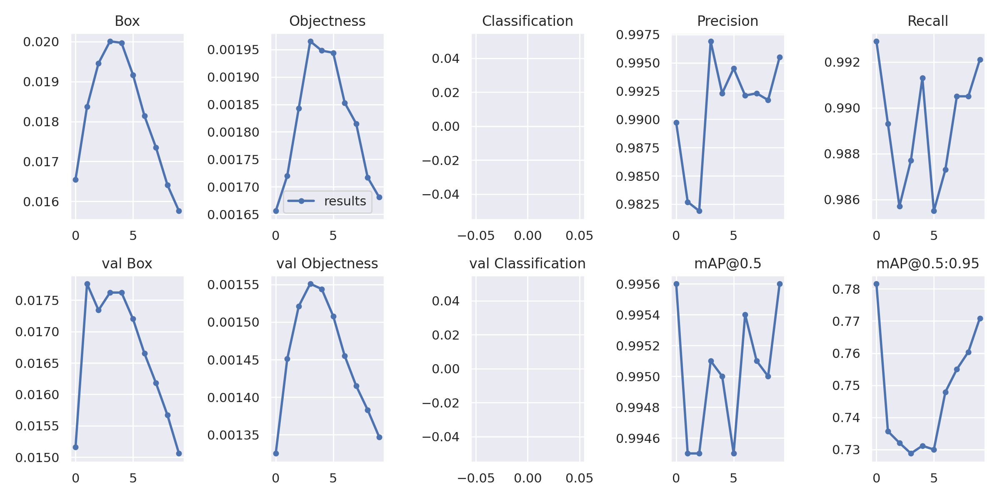


### F1 score: <a name="vcif1"></a>


### Example prediction collages: <a name="vciprediction"></a>

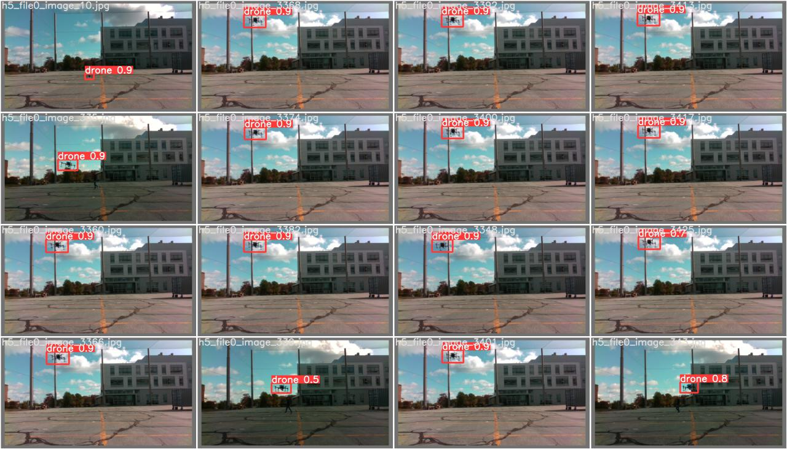
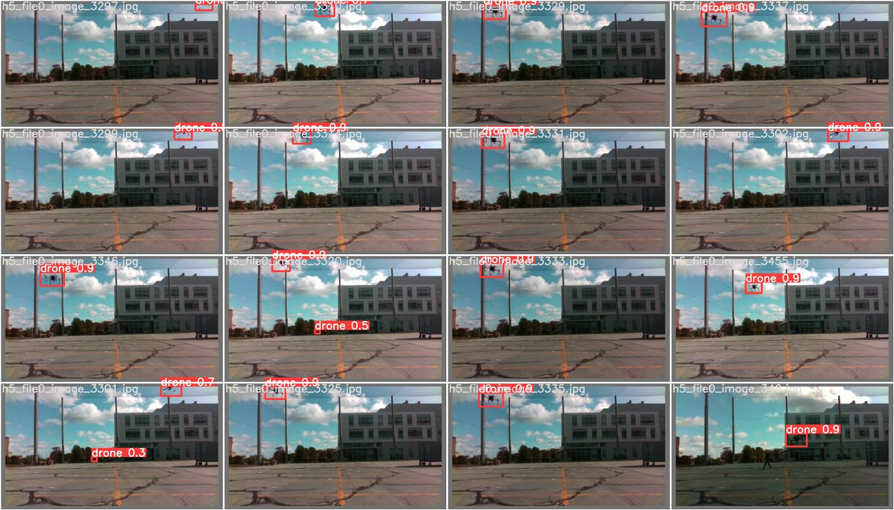

### Example inference:  <a name="vciinference"></a>


---

## Thermal 

### Metrics: <a name="thermalmetrics"></a>
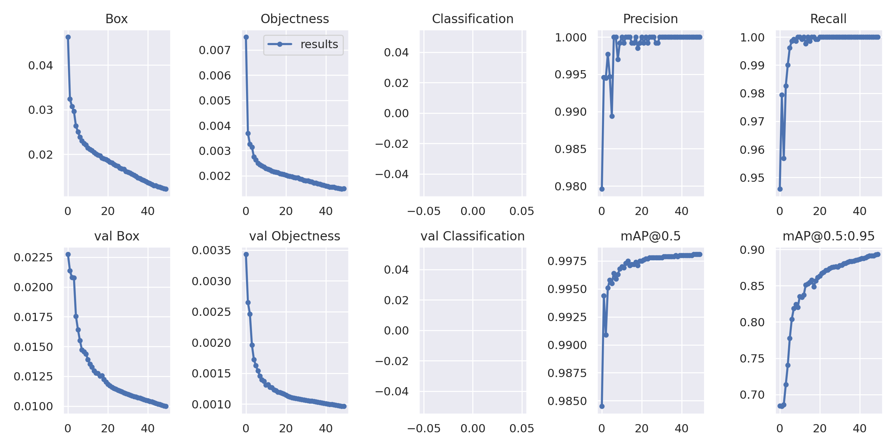


### F1 score: <a name="thermalf1"></a>
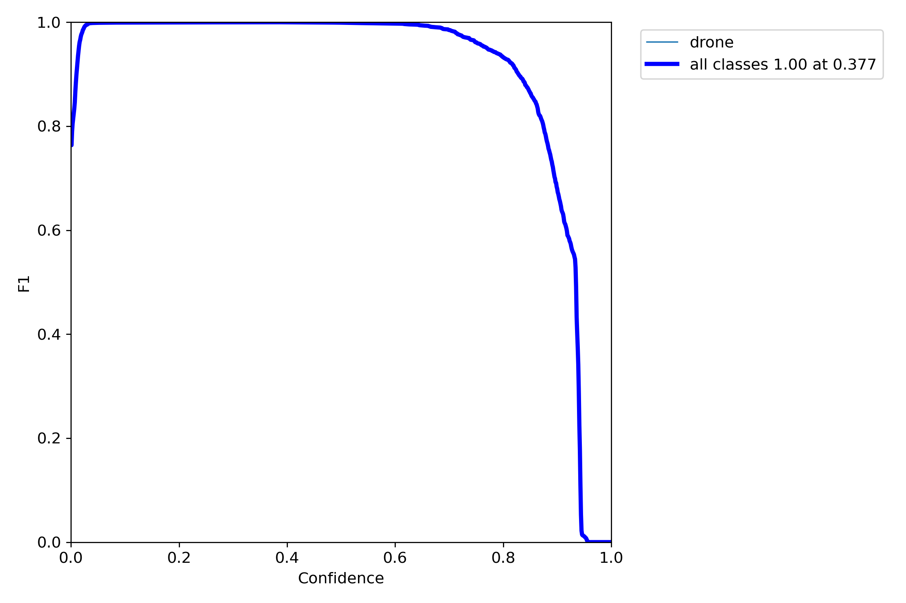


### Example prediction collages: <a name="thermalprediction"></a>

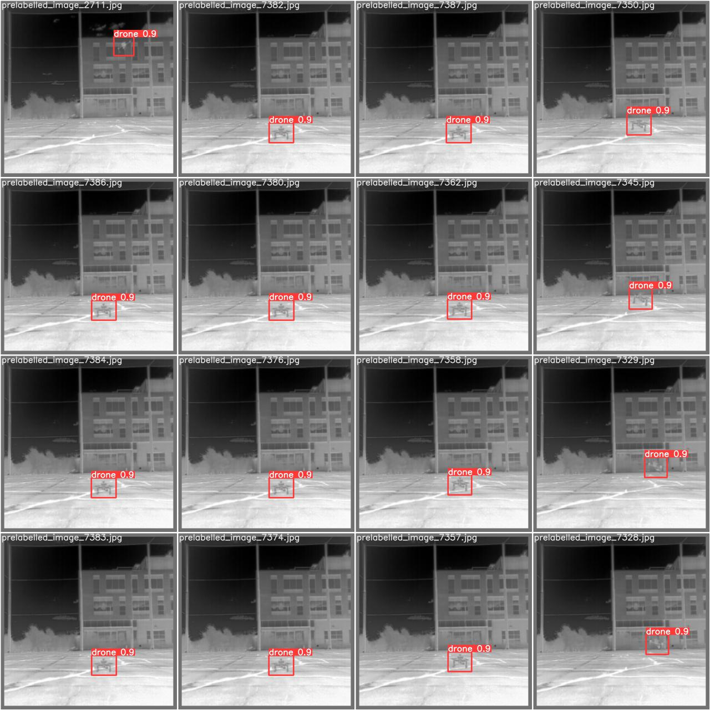
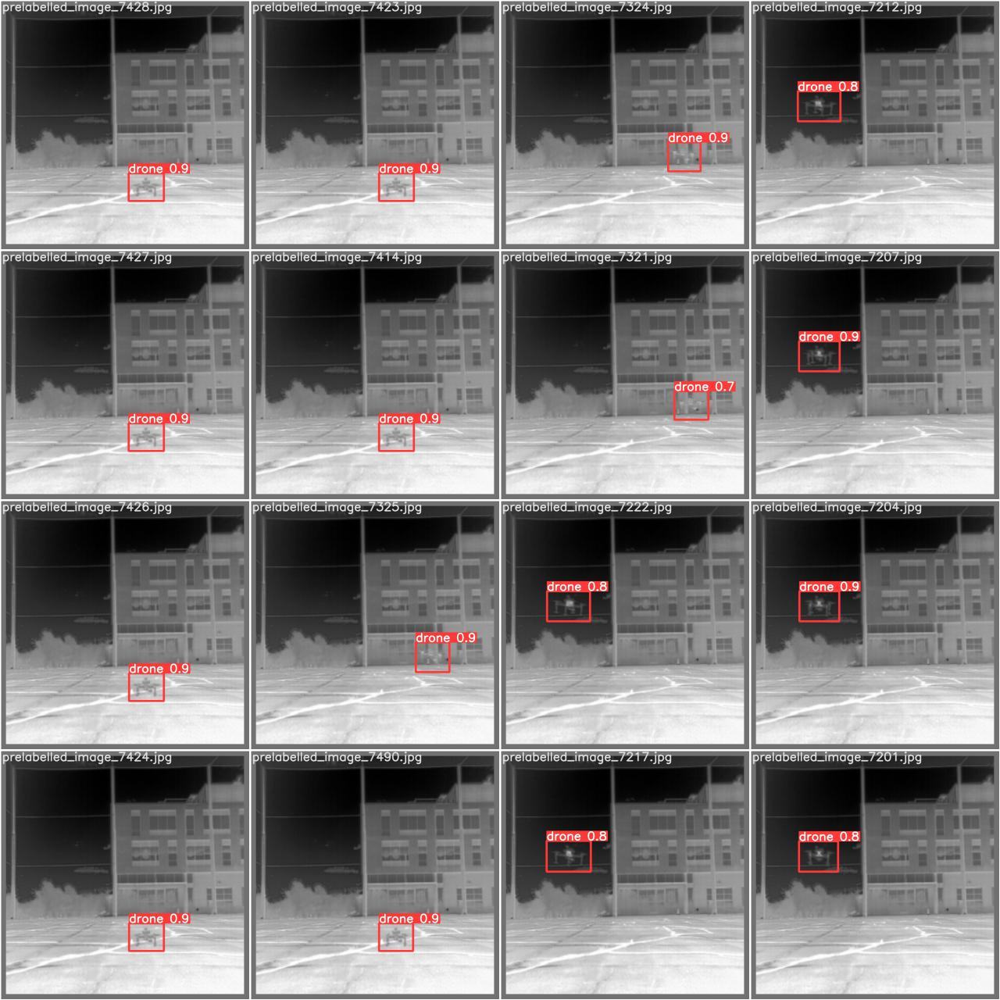

### Example inference: <a name="thermalinference"></a>

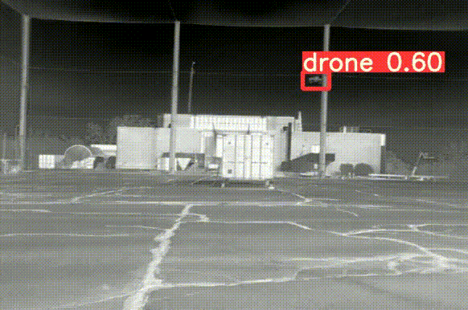

---

## Multispectral 

### Metrics: <a name="multimetrics"></a>
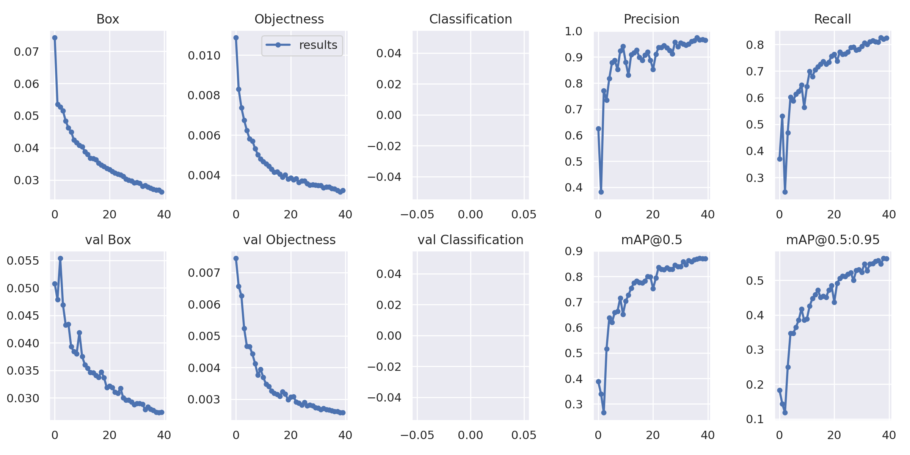


### F1 score: <a name="multif1"></a>
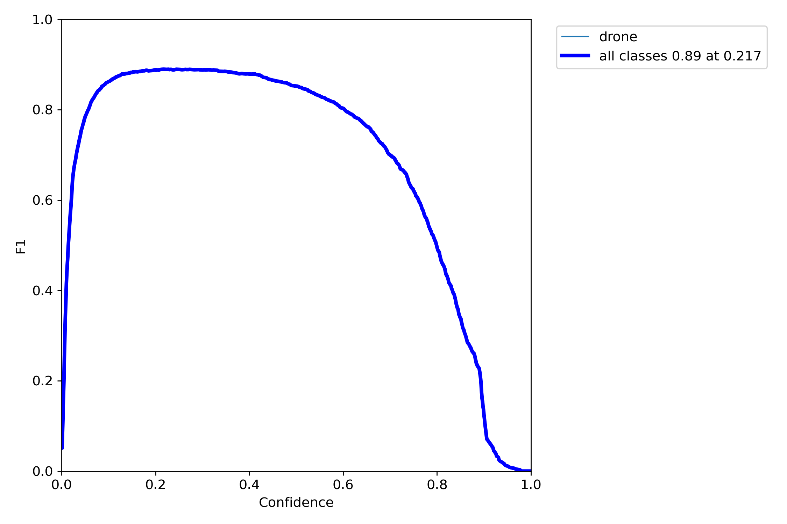


### Example prediction collages: <a name="multiprediction"></a>

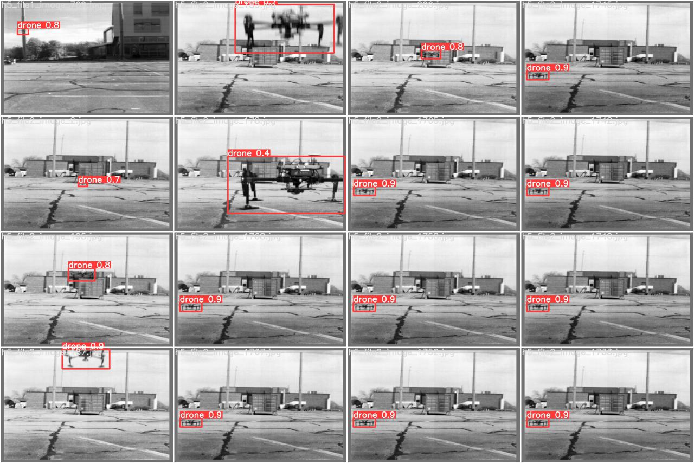
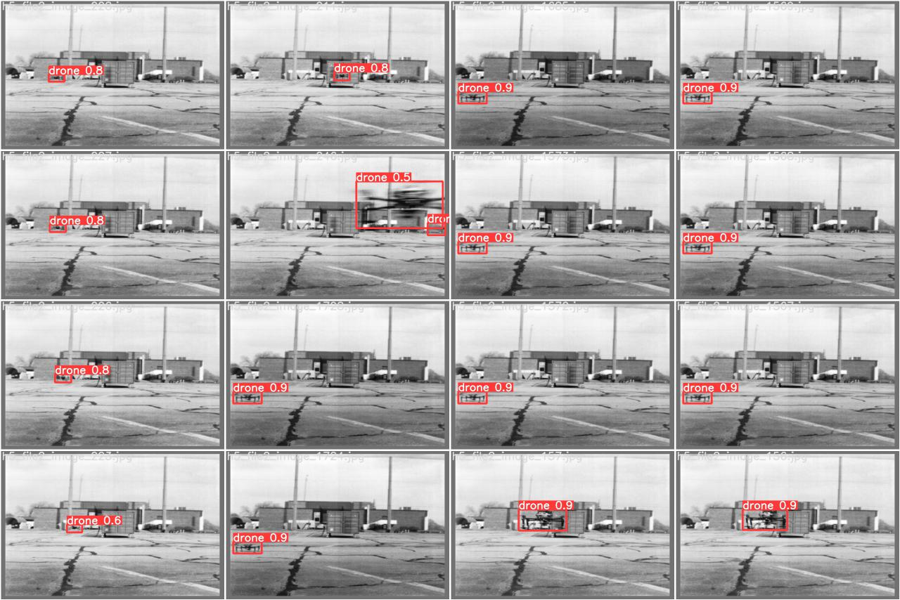

### Example inference: <a name="multiinference"></a>


---

## AFRL Fusion 

### Metrics: <a name="fusionmetrics"></a>
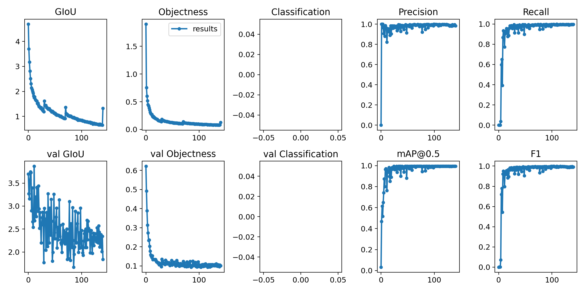


### Example prediction collages: <a name="fusionprediction"></a>

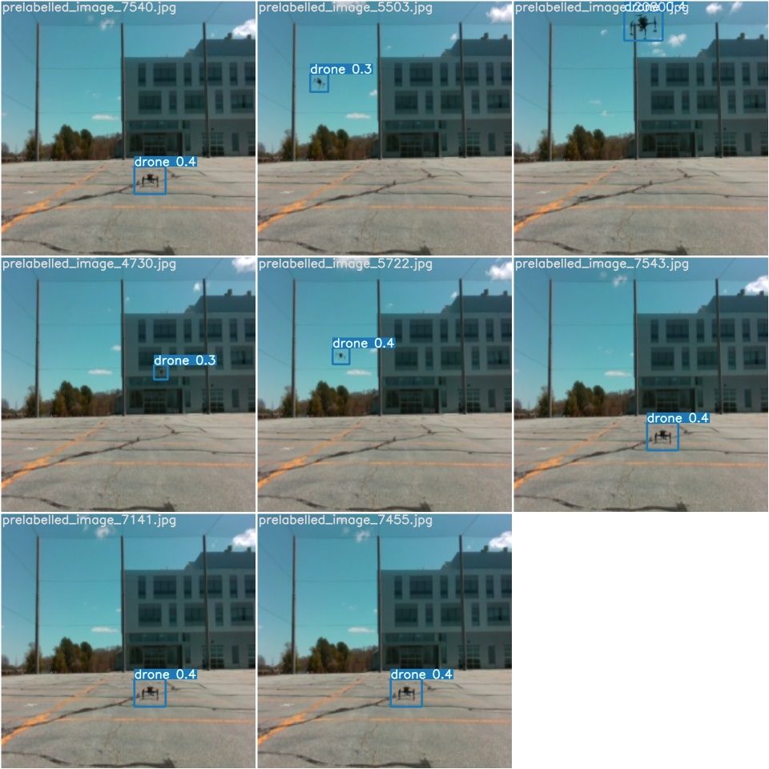

### Example inference: <a name="fusioninference"></a>


